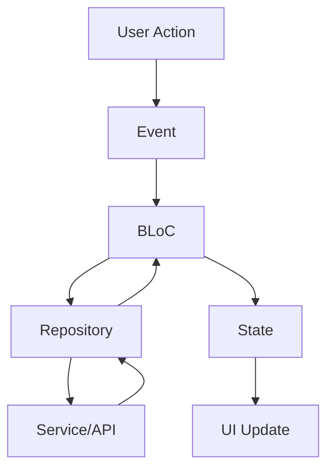

# 🏗️ Arquitectura MVVM con BLoC - DevLokos Podcast

## 📋 Resumen

Este proyecto implementa el patrón **MVVM (Model-View-ViewModel)** usando **BLoC (Business Logic Component)** como solución de gestión de estado en Flutter. Esta arquitectura proporciona una separación clara de responsabilidades y facilita el testing y mantenimiento del código.

## 🎯 Patrón MVVM

### **Model (Modelo)**
- **Ubicación**: `lib/models/`
- **Responsabilidad**: Definir la estructura de datos
- **Ejemplo**: `Episode` - Modelo que representa un episodio del podcast

### **View (Vista)**
- **Ubicación**: `lib/screens/`, `lib/widgets/`
- **Responsabilidad**: UI y presentación
- **Ejemplo**: `HomeScreen` - Pantalla principal que muestra la lista de episodios

### **ViewModel (BLoC)**
- **Ubicación**: `lib/bloc/`
- **Responsabilidad**: Lógica de negocio y gestión de estado
- **Ejemplo**: `EpisodeBloc` - Maneja toda la lógica relacionada con episodios

## 🔧 Componentes de la Arquitectura BLoC

### **1. Events (Eventos)**
```dart
// lib/bloc/episode/episode_event.dart
abstract class EpisodeEvent extends Equatable {
  const EpisodeEvent();
}

class LoadEpisodes extends EpisodeEvent {
  const LoadEpisodes();
}

class SearchEpisodes extends EpisodeEvent {
  final String query;
  const SearchEpisodes({required this.query});
}
```

**Propósito**: Representan las acciones que el usuario puede realizar.

### **2. States (Estados)**
```dart
// lib/bloc/episode/episode_state.dart
abstract class EpisodeState extends Equatable {
  const EpisodeState();
}

class EpisodeLoading extends EpisodeState {
  const EpisodeLoading();
}

class EpisodeLoaded extends EpisodeState {
  final List<Episode> episodes;
  final List<Episode> featuredEpisodes;
  final List<Episode> filteredEpisodes;
  final String searchQuery;
  
  const EpisodeLoaded({
    required this.episodes,
    required this.featuredEpisodes,
    required this.filteredEpisodes,
    this.searchQuery = '',
  });
}
```

**Propósito**: Representan los diferentes estados de la UI.

### **3. BLoC (Business Logic Component)**
```dart
// lib/bloc/episode/episode_bloc.dart
class EpisodeBloc extends Bloc<EpisodeEvent, EpisodeState> {
  final EpisodeRepository _repository;

  EpisodeBloc({required EpisodeRepository repository})
      : _repository = repository,
        super(const EpisodeInitial()) {
    
    on<LoadEpisodes>(_onLoadEpisodes);
    on<SearchEpisodes>(_onSearchEpisodes);
    // ... más manejadores de eventos
  }

  Future<void> _onLoadEpisodes(
    LoadEpisodes event,
    Emitter<EpisodeState> emit,
  ) async {
    emit(const EpisodeLoading());
    try {
      final episodes = await _repository.getAllEpisodes();
      emit(EpisodeLoaded(episodes: episodes, ...));
    } catch (e) {
      emit(EpisodeError(message: e.toString()));
    }
  }
}
```

**Propósito**: Contiene la lógica de negocio y maneja las transiciones de estado.

## 📁 Estructura de Directorios

```
lib/
├── bloc/                    # BLoC Components (ViewModel)
│   └── episode/
│       ├── episode_bloc.dart
│       ├── episode_event.dart
│       ├── episode_state.dart
│       └── episode_bloc_exports.dart
├── models/                  # Data Models
│   └── episode.dart
├── repository/              # Data Layer
│   └── episode_repository.dart
├── screens/                 # UI Views
│   ├── home/
│   └── episode/
├── services/                # External Services
│   └── youtube_scraper.dart
├── utils/                   # Utilities
│   └── app_theme.dart
└── widgets/                 # Reusable UI Components
    ├── episode_card.dart
    └── featured_episode_card.dart
```

## 🔄 Flujo de Datos



### **Ejemplo de Flujo Completo:**

1. **Usuario** hace scroll en la lista → **Evento**: `LoadEpisodes`
2. **BLoC** recibe el evento → Llama al **Repository**
3. **Repository** llama al **Service** (YouTube Scraper)
4. **Service** obtiene datos de la API
5. **Repository** procesa los datos
6. **BLoC** emite nuevo **Estado**: `EpisodeLoaded`
7. **UI** se actualiza automáticamente

## 🧪 Testing

### **Testing del BLoC**
```dart
// test/bloc/episode_bloc_test.dart
blocTest<EpisodeBloc, EpisodeState>(
  'emits [EpisodeLoading, EpisodeLoaded] when LoadEpisodes is successful',
  build: () => episodeBloc,
  act: (bloc) => bloc.add(const LoadEpisodes()),
  expect: () => [
    const EpisodeLoading(),
    const EpisodeLoaded(episodes: testEpisodes, ...),
  ],
);
```

### **Ventajas del Testing con BLoC:**
- **Predictible**: Estados bien definidos
- **Aislado**: Lógica separada de la UI
- **Testeable**: Fácil de mockear dependencias

## 🎨 Integración con UI

### **BlocProvider (Inyección de Dependencias)**
```dart
// main.dart
MultiBlocProvider(
  providers: [
    BlocProvider<EpisodeBloc>(
      create: (context) => EpisodeBloc(
        repository: EpisodeRepositoryImpl(),
      )..add(const LoadEpisodes()),
    ),
  ],
  child: MaterialApp.router(...),
)
```

### **BlocBuilder (Escuchar Estados)**
```dart
// screens/home/home_screen.dart
BlocBuilder<EpisodeBloc, EpisodeState>(
  builder: (context, state) {
    if (state is EpisodeLoading) {
      return const CircularProgressIndicator();
    }
    if (state is EpisodeLoaded) {
      return EpisodeList(episodes: state.episodes);
    }
    return const SizedBox.shrink();
  },
)
```

### **BlocConsumer (Escuchar + Acciones)**
```dart
BlocConsumer<EpisodeBloc, EpisodeState>(
  listener: (context, state) {
    if (state is EpisodeError) {
      ScaffoldMessenger.of(context).showSnackBar(
        SnackBar(content: Text(state.message)),
      );
    }
  },
  builder: (context, state) {
    // UI building logic
  },
)
```

## 🔍 Repository Pattern

```dart
// lib/repository/episode_repository.dart
abstract class EpisodeRepository {
  Future<List<Episode>> getAllEpisodes();
  Future<List<Episode>> searchEpisodes(String query);
}

class EpisodeRepositoryImpl implements EpisodeRepository {
  final YouTubeScraper _youtubeScraper;
  
  @override
  Future<List<Episode>> getAllEpisodes() async {
    return await _youtubeScraper.getPlaylistEpisodes();
  }
}
```

**Ventajas:**
- **Abstracción**: Separa la lógica de datos de la fuente
- **Testeable**: Fácil de mockear para tests
- **Flexible**: Puede cambiar la fuente de datos sin afectar el BLoC

## 📊 Comparación: Provider vs BLoC

| Aspecto | Provider | BLoC |
|---------|----------|------|
| **Complejidad** | Simple | Moderada |
| **Testing** | Básico | Avanzado |
| **Separación** | Básica | Excelente |
| **Escalabilidad** | Limitada | Excelente |
| **Debugging** | Básico | Avanzado |
| **Curva de Aprendizaje** | Baja | Media |

## 🚀 Ventajas de esta Arquitectura

### **1. Separación de Responsabilidades**
- **UI**: Solo se encarga de mostrar datos
- **BLoC**: Solo maneja lógica de negocio
- **Repository**: Solo maneja acceso a datos

### **2. Testabilidad**
- Cada componente se puede testear independientemente
- Fácil mockeo de dependencias
- Estados predecibles y verificables

### **3. Escalabilidad**
- Fácil agregar nuevas funcionalidades
- Reutilización de componentes
- Mantenimiento simplificado

### **4. Debugging**
- Estados claramente definidos
- Flujo de datos trazable
- Herramientas de debugging integradas

## 🔧 Comandos Útiles

```bash
# Instalar dependencias
flutter pub get

# Ejecutar tests
flutter test

# Análisis de código
flutter analyze

# Generar reporte de cobertura
flutter test --coverage

# Ejecutar la app
flutter run
```

## 📚 Recursos Adicionales

- [Flutter BLoC Documentation](https://bloclibrary.dev/)
- [BLoC Pattern Tutorial](https://bloclibrary.dev/getting-started/)
- [Repository Pattern in Flutter](https://medium.com/flutter-community/repository-pattern-in-flutter-3b2d6d7b6b8e)
- [Testing BLoC in Flutter](https://bloclibrary.dev/testing/)

## 🎯 Próximos Pasos

1. **Agregar más BLoCs** para otras funcionalidades
2. **Implementar persistencia local** con Hive/SQLite
3. **Agregar tests de integración**
4. **Implementar error handling** más robusto
5. **Agregar logging** estructurado
6. **Implementar offline support**

---

Esta arquitectura MVVM con BLoC proporciona una base sólida y escalable para el desarrollo de aplicaciones Flutter complejas, manteniendo el código organizado, testeable y mantenible.
